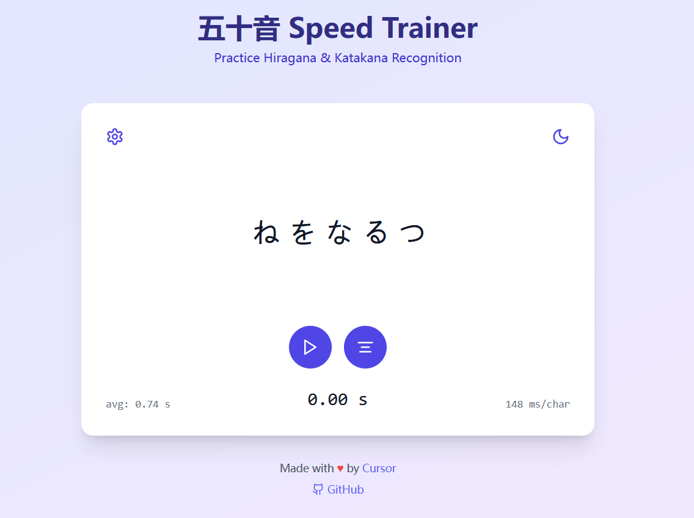
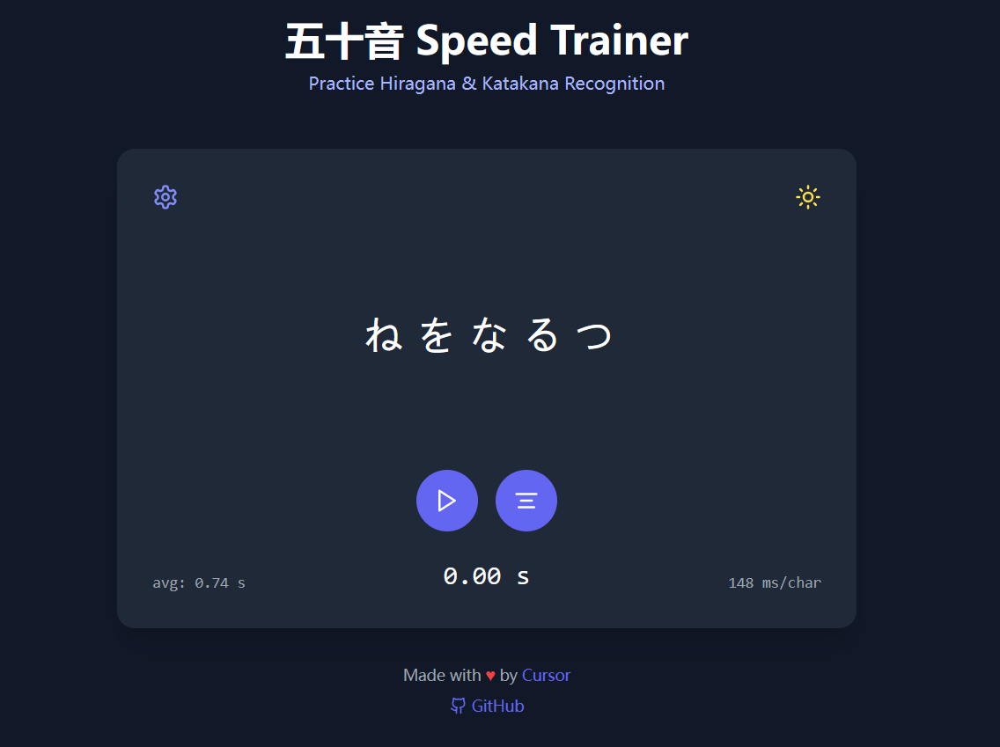

# Kana

[English](README.md) | [中文](docs/README_zh.md) | [Demo](https://lets.go50.store)

A minimal and efficient trainer for mastering Japanese Kana recognition speed. Practice your Hiragana and Katakana recognition with instant feedback and performance tracking.

<table width="100%">
  <tr>
    <th width="50%">Light Mode</th>
    <th width="50%">Dark Mode</th>
  </tr>
  <tr>
    <td></td>
    <td></td>
  </tr>
</table>

## Features

- 🎯 Focus on speed recognition training
- 🔄 Practice both Hiragana and Katakana
- ⚡ Advanced options for Dakuon (濁音) and Youon (拗音)
- ⏱️ Real-time performance tracking
- 📊 Average time and per-character speed statistics
- 🌓 Dark/Light mode support
- 🎨 Clean, minimalist interface

## Usage

1. Select your preferred character types:
   - Hiragana (ひらがな)
   - Katakana (カタカナ)
   - Dakuon (濁音: が、ざ、だ、ば、ぱ)
   - Youon (拗音: きょ、しゃ、ちゅ)

2. Set the number of characters you want to practice

3. Click the play button to start
   - Click to check your answer
   - See your response time and average speed

## Development

Built with:
- React
- TypeScript
- Tailwind CSS
- Vite

### Local Setup 
```bash
# Clone the repository
git clone https://github.com/Plasma-Blue/Kana

# Navigate to project directory
cd Kana

# Install dependencies
npm install

# Start development server
npm run dev
``` 

### Contributing

1. Fork the project
2. Create a feature branch (`git checkout -b feature/AmazingFeature`)
3. Commit your changes (`git commit -m 'Add some AmazingFeature'`)
4. Push to the branch (`git push origin feature/AmazingFeature`)
5. Open a Pull Request

## License

This project is licensed under the MIT License - see the [LICENSE](LICENSE) file for details.

## Acknowledgments

- Made with ♥ by [Ryo](https://github.com/plasma-blue)
- Built with [Cursor](https://cursor.sh)
- Inspired by the need for efficient Japanese character recognition training
